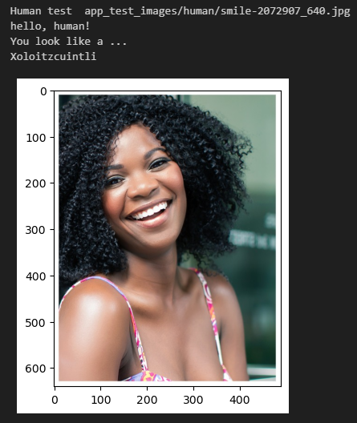
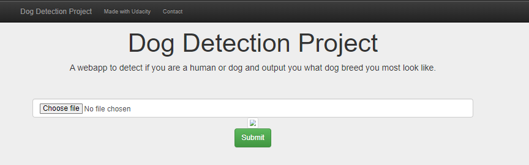

# Dog Breed Classifer Project


### Summary
This project uses Convolutional Neural Networks (CNNs). In this project, I learnt how to build a pipeline to process real-world, user-supplied images. Given an image of a dog, my algorithm will identify an estimate of the canine’s breed. If supplied an image of a human, the code will identify the resembling dog breed.

The project includes a Flask web app where a user can input a new image and get classification of human / dog / or an error if they are neither plus the closest resembling dog breed. 

## Files in Repository
 - Root Directory
    - app (files relating to the application and new predictions from model)
		- static
			- css
				- custom.css (styling file)
			- js
				-image_upload.js (javascript for uploading image)
        - templates
            - index.html
            - layout.html
			- result.html
		- uploads (folder for uploaded images)
        - app.py
		- dog_names.txt
		- model.py
    - app_test_images (folder containing images for final algorithm test)
	- haarcascades
	- images (images in notebook)
    - notebook (notebooks used in developing the scripts)
        - dog_app.ipynb
        - extract_bottleneck_features.py
    - LICENSE.txt
	- requirements.txt
	- train_model.py

Screenshot of notebook output:



## Project setup

### Instructions

1. Clone the repository and navigate to the downloaded folder.
```	
git clone https://github.com/Duella12345/dog_project.git
cd dog-project
```

2. Download the [dog dataset](https://s3-us-west-1.amazonaws.com/udacity-aind/dog-project/dogImages.zip).  Unzip the folder and place it in the repo, at location `path/to/dog-project/dogImages`. 

3. Download the [human dataset](https://s3-us-west-1.amazonaws.com/udacity-aind/dog-project/lfw.zip).  Unzip the folder and place it in the repo, at location `path/to/dog-project/lfw`.  If you are using a Windows machine, you are encouraged to use [7zip](http://www.7-zip.org/) to extract the folder. 

4. Download the [VGG-16 bottleneck features](https://s3-us-west-1.amazonaws.com/udacity-aind/dog-project/DogVGG16Data.npz) for the dog dataset.  Place it in the repo, at location `path/to/dog-project/bottleneck_features`.

5. Download the [Resnet-50 bottleneck features](https://s3-us-west-1.amazonaws.com/udacity-aind/dog-project/DogResnet50Data.npz) for the dog dataset.  Place it in the repo, at location `path/to/dog-project/bottleneck_features`.

6. Open the notebook and run all to see the development process.
```
jupyter notebook dog_app.ipynb
```

7. Run the following commands in the project's root directory to set up model, this may take a few minutes to run.

    - To run the model training pipeline:
        
        `python train_model.py` (using defaults)

2. To run the app: go to `app` directory: `cd app`

3. Run the web app: `flask --app app.py run`

4. Visit 'http://127.0.0.1:5000' to open the homepage


5. Click on 'choose file' and upload an image of a person or a dog and press submit (it may take a few moments)


6. See your prediction!
